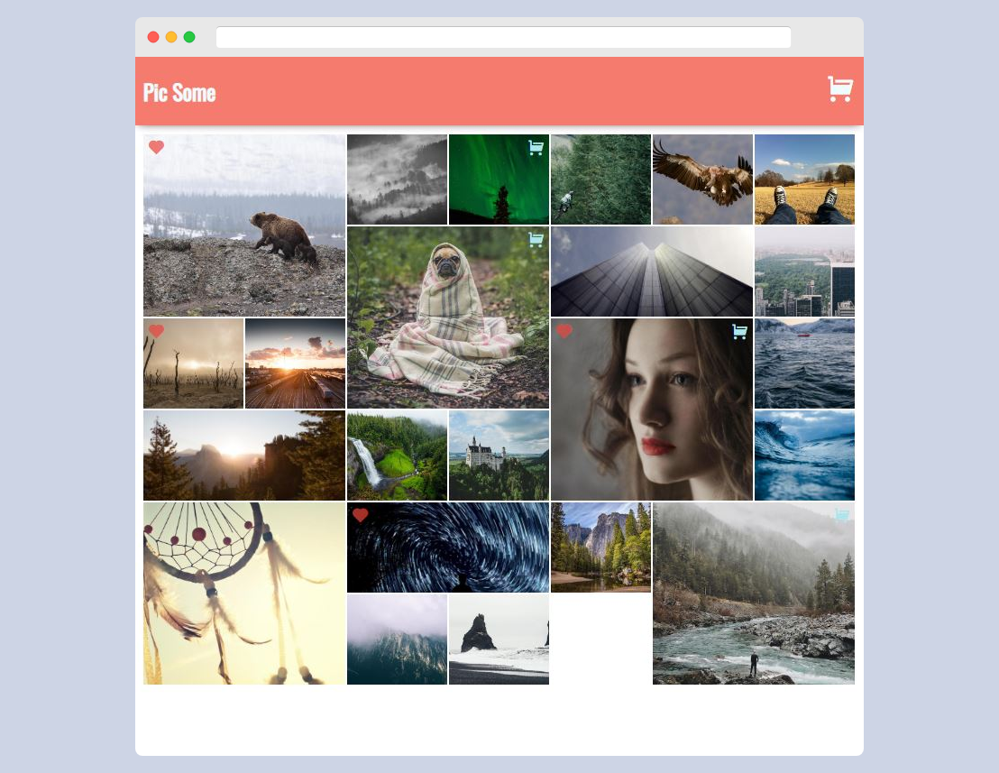

# Pic Some Web Shop

  

## Table of Contents

* [Description](#description)
* [React concepts](#react-concepts)
* [Technologies Used](#technologies-used)

## Description
Picsome Shop is a mock online shop using React. I used my knowledge from Scrimba's Advanced React course to create a dynamic and engaging experience for users. 

The app features a home page where users can browse and favorite products, and a cart page where they can manage the items they've added to their cart. I designed the app to be highly interactive and responsive, making it easy for users to navigate and interact with the various features. The end result is a seamless shopping experience that provides value to the users.

## React concepts

The following are some of the topics that I learnt and implemented along the way:

- React Hooks
- React Router
- React Context
- defaultProps
- propTypes
- Children
- Organizing components
- Optimazation

## Technologies Used
- React
- Router
- Create-React-App
- Netlify
- Netlify Serverless Functions (hosting)
- HTML
- CSS
- Web API

## Author
[Jym Bocala](https://github.com/jymbocala)